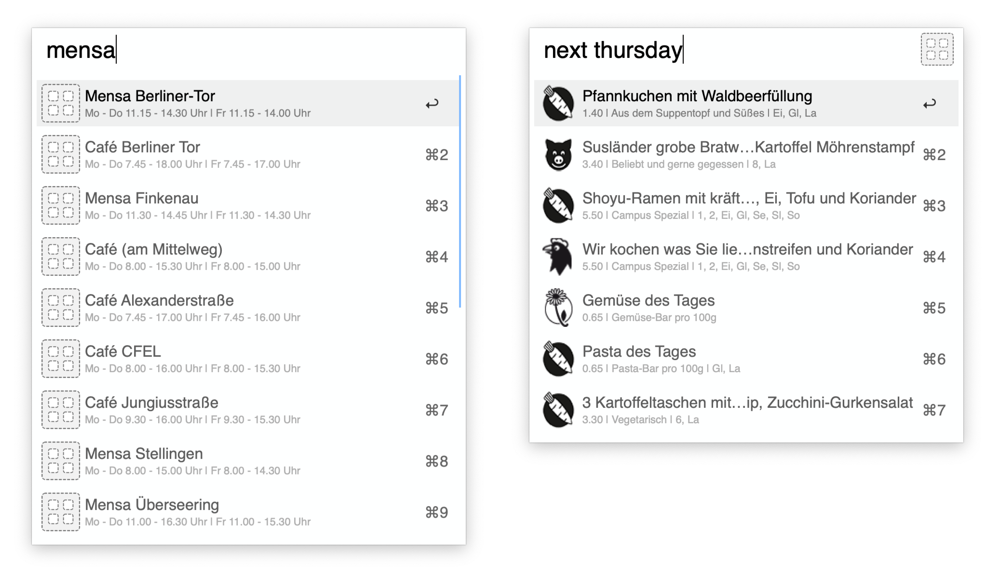

# Hamburg Cafeterias

This workflow gives easy access to all [Studierendenwerk Cafeterias](https://www.studierendenwerk-hamburg.de/studierendenwerk/de/essen/mensen_und_cafes/) in Hamburg.

In the first step you can select the canteen (optional argument to filter by name). Also with the `cmd`-modifier the menu for the canteen can be opend in your browser, with the `alt`-modifier you show the canteen on Google Maps.

For the selected canteen the menu for current day will be displayed, or your can provide an relative or absolute day, for example:

- `+2days`
- `-10days`
- `2020-01-27`
- `next monday`

See [strtotime()](https://www.php.net/manual/en/function.strtotime.php) for more examples.

The menu data come from [HAWHHCalendarBot/mensa-data](https://github.com/HAWHHCalendarBot/mensa-data) repository by [EdJoPaTo](https://github.com/EdJoPaTo).